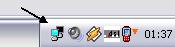



## Lights Out \(Update \#1\)

### Description

This was inspired by an earlier submission to PSC (whis seems to have disappeared when I looked for it again to give credit to the original author) and it will dim your monitor after a period of idleness or when you expicitely want it. It runs in the system tray and requires no measurable resources. ***Updated for smooth transition and TimeoutDisable. Try it, download is only 8.5 kB.
 
### More Info
 

             |
---                |---
**Submitted On**   |2006-09-07 21:22:28
**By**             |[ULLI](https://github.com/Planet-Source-Code/PSCIndex/blob/master/ByAuthor/ulli.md)
**Level**          |Intermediate
**User Rating**    |4.9 (39 globes from 8 users)
**Compatibility**  |VB 6\.0
**Category**       |[Miscellaneous](https://github.com/Planet-Source-Code/PSCIndex/blob/master/ByCategory/miscellaneous__1-1.md)
**World**          |[Visual Basic](https://github.com/Planet-Source-Code/PSCIndex/blob/master/ByWorld/visual-basic.md)
**Archive File**   |[Lights\_Out201866982006\.zip](https://github.com/Planet-Source-Code/ulli-lights-out-update-1__1-66492/archive/master.zip)

